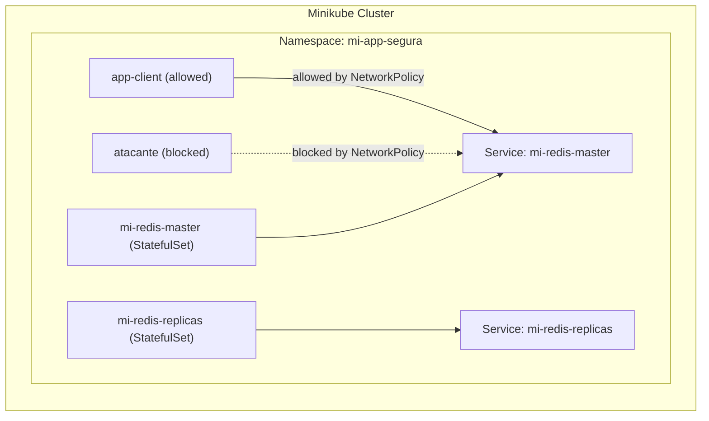

# Ejercicio Práctico de Kubernetes — Redis seguro en Minikube

[](https://minikube.sigs.k8s.io/)
[](https://kubernetes.io/)
[](https://helm.sh/)
[](https://hub.docker.com/orgs/bitnamilegacy/repositories)

> **Nota importante**: en este laboratorio usamos **Minikube**. Además, debido a cambios en la política de Bitnami (agosto 2025) muchas imágenes Debian gratuitas fueron movidas a `bitnamilegacy/redis` o retiradas del catálogo principal; por eso este ejercicio usa una imagen _legacy_ para que funcione en el entorno del curso. Esto **no** es recomendable para producción.

---

## Índice

1. Objetivo
2. Diagrama general (Mermaid)
3. Requisitos previos
4. Resumen de pasos
5. Comandos detallados (PowerShell) — explicación línea por línea
6. Pruebas de seguridad
7. Pruebas adicionales (cliente Redis)
8. Troubleshooting y notas sobre imágenes Bitnami
9. Cómo descargar y usar este README

---

## 1) Objetivo

Desplegar Redis en un namespace seguro (`mi-app-segura`) dentro de Minikube usando Helm (chart `bitnami/redis`), validando:

- SecurityContext / PodSecurity (no correr como root)
- NetworkPolicy (solo un cliente permitido puede hablar con Redis)
- RBAC (cuenta `devops-user` con permisos limitados)
- Conexión funcional desde un pod cliente autorizado

---

## 2) Diagrama general (Mermaid)



---

## 3) Requisitos previos

- Minikube instalado y funcionando (driver Docker)
- kubectl configurado para usar el contexto `minikube`
- Helm (v3) instalado en tu máquina (PowerShell)
- Docker (opcional, para `docker pull` si quieres comprobar imágenes)
- Este README contiene comandos pensados para **PowerShell**. Si usas Linux/macOS algunos comandos (p. ej. `base64 -d`) cambian.

---

## 4) Resumen de pasos

1. Crear namespace `mi-app-segura`.
2. Aplicar manifests base: `cliente-y-red.yaml` (pod cliente y NetworkPolicy).
3. Crear RBAC (`rbac.yaml`) para la cuenta `devops-user`.
4. Cargar imagen `busybox` en Minikube (si hace falta).
5. Instalar Redis con Helm apuntando a `bitnamilegacy/redis:8.2.1-debian-12-r0`.
6. Comprobar que pods estén `Running`.
7. Validar `securityContext` (runAsUser no root).
8. Realizar pruebas NetworkPolicy: `app-client` (permitido) y `atacante` (bloqueado).
9. Validar RBAC con `kubectl auth can-i`.
10. Conectar con `redis-cli` desde un pod cliente y hacer pruebas (PING, SET, GET).

---

## 5) Comandos detallados (PowerShell) — explicación línea por línea

> **Importante:** abre una terminal nueva para ejecutar los comandos. Todos los comandos aquí están formateados para **PowerShell** (Windows). Si copias/pegas, ejecútalos en **PowerShell**.

### 5.1 Crear namespace

```powershell
kubectl create namespace mi-app-segura
```

**Qué hace / provoca**: crea el namespace `mi-app-segura` donde desplegaremos recursos. Si ya existe, verás `namespace/... created` o `already exists` si lo reaplicas.

---

### 5.2 Aplicar los manifests de cliente y NetworkPolicy

```powershell
kubectl apply -f cliente-y-red.yaml
```

**Qué hace**: aplica el YAML que debería crear `app-client` (pod o deployment) y una `NetworkPolicy` que permita el tráfico solo desde `app-client` a Redis. Esto configura el entorno de pruebas de red.

---

### 5.3 Aplicar RBAC

```powershell
kubectl apply -f rbac.yaml
```

**Qué hace**: crea un `Role`, `ServiceAccount` (`devops-user`) y `RoleBinding`. El `Role` suele permitir lecturas de pods; el `RoleBinding` ata ese `Role` a la cuenta `devops-user`.

---

### 5.4 Cargar / asegurar la imagen `busybox` en minikube

En Minikube, para evitar problemas de que el nodo no pueda tirar imágenes externas (según tu entorno), puedes cargar la imagen localmente:

```powershell
docker pull busybox
minikube image load busybox
```

**Qué hace**: `docker pull busybox` descarga la imagen en tu host Docker; `minikube image load busybox` copia la imagen al daemon de Docker que usa Minikube (útil cuando Minikube corre en un VM o en Docker Desktop).

Nota: si tu Minikube ya puede acceder a internet, `minikube image load` no es estrictamente necesario.

---

### 5.5 Instalar Redis con Helm (usamos imagen legacy)

```powershell
helm uninstall mi-redis -n mi-app-segura  # (opcional, limpiar una instalación previa)

helm install mi-redis bitnami/redis `
  -n mi-app-segura `
  --set image.repository=bitnamilegacy/redis `
  --set image.tag=8.2.1-debian-12-r0
```

**Qué hace**: instala el chart `bitnami/redis` en el namespace `mi-app-segura`.

- `--set image.repository` indica usar `bitnamilegacy/redis` en vez del repo `bitnami/redis`.
- `--set image.tag` fija la etiqueta legacy `8.2.1-debian-12-r0` que aún está disponible en la organización `bitnamilegacy`.  
  Esto evita `ErrImagePull` por tags que ya no existen en el catálogo principal.

**Por qué usamos legacy**: Bitnami movió muchas imágenes al repositorio `bitnamilegacy` y retiró soporte gratis para ciertas imágenes Debian. Para mantener el ejercicio funcionando en el entorno del curso usamos una imagen legacy (solo para laboratorio/demo).

---

### 5.6 Verificar pods

```powershell
kubectl get pods -n mi-app-segura -l app.kubernetes.io/name=redis
```

**Qué hace**: lista los pods del chart Redis. Deberías ver `mi-redis-master-0` y `mi-redis-replicas-*` y su estado (`Running`).

---

### 5.7 Obtener el nombre del pod Redis (PowerShell)

```powershell
$REDIS_POD = (kubectl get pods -n mi-app-segura -l app.kubernetes.io/name=redis -o jsonpath='{.items[0].metadata.name}')
```

**Qué hace**: guarda el nombre del primer pod Redis en la variable de PowerShell `$REDIS_POD`. Útil para usar en comandos subsiguientes.

---

### 5.8 Verificar SecurityContext del contenedor (ejemplo)

```powershell
kubectl get pod $REDIS_POD -n mi-app-segura -o jsonpath="{.spec.containers[*].securityContext}"
```

**Qué hace**: imprime el `securityContext` aplicado a los contenedores del pod. Esperamos ver `runAsUser: 1001`, `runAsNonRoot: true`, `allowPrivilegeEscalation: false`, etc.

---

### 5.9 Verificar Pod-level securityContext (fsGroup)

```powershell
kubectl get pod $REDIS_POD -n mi-app-segura -o yaml | Select-String "securityContext" -Context 2,4
```

**Qué hace**: busca en el YAML del pod bloques que contengan `securityContext` (tanto a nivel container como a nivel pod). `fsGroup: 1001` es usual en estos charts.

---

### 5.10 Obtener la contraseña Redis en PowerShell

```powershell
$REDIS_PASSWORD = (kubectl get secret --namespace mi-app-segura mi-redis -o jsonpath="{.data.redis-password}" | %{ [System.Text.Encoding]::UTF8.GetString([System.Convert]::FromBase64String($_)) })
echo $REDIS_PASSWORD
```

**Qué hace**: obtiene el secreto `mi-redis` generado por Helm, decodifica el `redis-password` desde base64 y lo almacena en `$REDIS_PASSWORD`. En Linux/macOS se podría usar `base64 -d` en su lugar.

---

### 5.11 Crear un pod cliente (redis-client) para conectarse a Redis

```powershell
kubectl run --namespace mi-app-segura redis-client --restart='Never' `
  --env REDIS_PASSWORD=$REDIS_PASSWORD `
  --image=bitnamilegacy/redis:8.2.1-debian-12-r0 --command -- sleep infinity
```

**Qué hace**: corre un pod llamado `redis-client` que permanece en `sleep infinity` para que puedas `exec` dentro y usar `redis-cli`. Le pasamos la variable de entorno `REDIS_PASSWORD`.

---

### 5.12 Entrar al pod cliente

```powershell
kubectl exec -it redis-client -n mi-app-segura -- bash
```

**Qué hace**: abre una shell interactiva dentro del pod `redis-client`.

Dentro del pod, usarás:

```bash
REDISCLI_AUTH=$REDIS_PASSWORD redis-cli -h mi-redis-master
```

**Qué hace**: ejecuta redis-cli apuntando al servicio `mi-redis-master` usando la contraseña del secret.

Pruebas dentro del pod:

```bash
PING
SET saludo "Hola Mundo"
GET saludo
```

**Qué debe responder**: `PONG`, `OK`, y `"Hola Mundo"` respectivamente.

---

### 5.13 Probar NetworkPolicy — atacante (debe fallar)

```powershell
kubectl run atacante --rm -it --image=busybox -n mi-app-segura -- sh -c "telnet -w 2 mi-redis-master.mi-app-segura.svc.cluster.local 6379"
```

**Qué hace**: crea un pod `atacante` temporal con `busybox` y le pide intentar abrir una conexión telnet al servicio Redis. Con la `NetworkPolicy` aplicada, **esto debe fallar** (timeout o connection refused).

---

### 5.14 Probar NetworkPolicy — cliente (debe conectar)

```powershell
kubectl exec -it app-client -n mi-app-segura -- telnet mi-redis-master.mi-app-segura.svc.cluster.local 6379
```

**Qué hace**: desde el pod `app-client` (que la NetworkPolicy permite) intenta conectar a Redis — debe conectarse.

---

### 5.15 Probar RBAC (permisos de devops-user)

```powershell
kubectl auth can-i delete pod -n mi-app-segura --as=system:serviceaccount:mi-app-segura:devops-user
kubectl auth can-i get pod -n mi-app-segura --as=system:serviceaccount:mi-app-segura:devops-user
```

**Qué hace**: simula la solicitud de acciones como si vinieran de la `ServiceAccount` `devops-user`. Esperamos:

- `delete pod` → **no**
- `get pod` → **yes**

---

### 5.16 Port-forward (opcional) — acceder desde tu máquina

En una terminal nueva (abrir nueva terminal) ejecuta:

```powershell
kubectl port-forward --namespace mi-app-segura svc/mi-redis-master 6379:6379
```

**Qué hace**: conecta el puerto local `127.0.0.1:6379` al servicio Redis en el clúster para que puedas usar un cliente Redis desde tu PC. **IMPORTANTE**: este comando mantiene la terminal ocupada mientras esté corriendo; abre una terminal nueva para no bloquear tu workflow.

Para conectar localmente:

```powershell
redis-cli -h 127.0.0.1 -p 6379 -a $REDIS_PASSWORD
```

---

## 6) Pruebas de seguridad

- `kubectl create namespace mi-app-segura` ✅
- `kubectl apply -f cliente-y-red.yaml` ✅
- `docker pull busybox` → _en este caso usas Minikube_ así que `minikube image load busybox` ✅
- `helm install/upgrade mi-redis bitnami/redis -n mi-app-segura -f redis-values.yaml --set image.tag=...` → en este laboratorio debes seleccionar una imagen disponible (por eso usamos `bitnamilegacy/redis:8.2.1-debian-12-r0`) ✅
- Verificar `securityContext` para usuario no-root (runAsUser=1001) ✅
- Pruebas NetworkPolicy (cliente OK, atacante bloqueado) ✅
- Pruebas RBAC (devops-user read-only) ✅

---

## 7) Pruebas adicionales (cliente Redis)

- Cómo obtener el secreto y decodificar en PowerShell (comando explicado) ✅
- Crear `redis-client` pod, `kubectl exec` dentro y usar `redis-cli` para `PING`, `SET`, `GET` ✅
- Se mostró cómo abrir una nueva terminal para `kubectl port-forward` y conectar desde tu máquina local ✅

---

## 8) Troubleshooting y notas sobre imágenes Bitnami

- Si ves `ImagePullBackOff` o `ErrImagePull`: eso indica que la etiqueta de imagen **no existe** en el repositorio configurado.
- Ejemplo problemático: `bitnami/redis:7.0.12-debian-11-r0` → ya no existe → `manifest unknown`.
- Soluciones:
  - Usar `bitnamilegacy/redis` con una etiqueta existente (`8.2.1-debian-12-r0`, `8.0.3-debian-12-r3`, `6.2.9-debian-11-r0`).
  - O usar la imagen oficial `redis:7` (requiere ajustar `values.yaml` del chart porque Bitnami añade settings propios).
  - Confirmar descargando en tu host: `docker pull bitnamilegacy/redis:8.2.1-debian-12-r0`.

**Recordatorio de seguridad**: las imágenes legacy no reciben parches; NO USAR en producción.

## Anexo: ejemplos de `redis-values.yaml` y `rbac.yaml`

> **Nota:** tu repo del curso contiene `redis-values.yaml`, `cliente-y-red.yaml`, `rbac.yaml`. Este README asume que los YAML provistos por el profesor están correctos para el ejercicio y que solo necesitas adaptar la imagen si hay errores de `ImagePull`.

---

## LIMPIEZA DE RECURSOS

### 1) Desinstalar release de Helm (el chart de Redis)

helm uninstall mi-redis -n mi-app-segura --wait --timeout 2m

### 1b) (alternativa tolerante si no quieres errores si no existe)

helm uninstall mi-redis -n mi-app-segura --wait --timeout 30s 2>$null

### 2) Eliminar manifiestos aplicados (cliente + networkpolicy)

kubectl delete -f cliente-y-red.yaml -n mi-app-segura --ignore-not-found

### 3) Eliminar RBAC (role, sa, rolebinding)

kubectl delete -f rbac.yaml -n mi-app-segura --ignore-not-found

### 4) Eliminar el pod cliente "redis-client" si lo creaste manualmente

kubectl delete pod redis-client -n mi-app-segura --ignore-not-found

### 5) Eliminar pod atacante temporal (si quedó)

kubectl delete pod atacante -n mi-app-segura --ignore-not-found

### 6) Eliminar Secrets y ConfigMaps generados por Helm (por si quedaron)

kubectl delete secret mi-redis -n mi-app-segura --ignore-not-found
kubectl delete configmap mi-redis-configuration -n mi-app-segura --ignore-not-found
kubectl delete configmap mi-redis-health -n mi-app-segura --ignore-not-found
kubectl delete configmap mi-redis-scripts -n mi-app-segura --ignore-not-found

### 7) Eliminar PersistentVolumeClaims en el namespace (si existen)

kubectl get pvc -n mi-app-segura
kubectl delete pvc --all -n mi-app-segura --ignore-not-found

### 8) (Opcional) Ver y eliminar PersistentVolumes residuales (si existieron PVCs y PV quedó en Retain)

kubectl get pv

### 9) Eliminar el namespace (esto remueve cualquier recurso restante dentro)

kubectl delete namespace mi-app-segura --ignore-not-found

### 10) Limpiar imágenes del daemon Docker de Minikube (desplegadas en el nodo)

minikube image rm bitnamilegacy/redis:8.2.1-debian-12-r0 2>$null
minikube image rm busybox 2>$null

### 11) Limpiar imágenes Docker locales en tu máquina (opcional)

docker images --format "{{.Repository}}:{{.Tag}} {{.ID}}" | Select-String "bitnamilegacy/redis|busybox" | ForEach-Object {
$img = ($\_ -split ' ')[0]
docker rmi $img -f 2>$null
}

### 12) (Opcional) Quitar repo Helm si no lo necesitas

helm repo remove bitnami 2>$null

### 13) (Opcional/Drástico) Borrar el clúster Minikube por completo (si quieres reiniciar todo)

minikube stop
minikube delete

### 14) Comprobar que no queda nada importante

kubectl get all -A
kubectl get namespaces
kubectl get pv
kubectl get pvc -A

---
